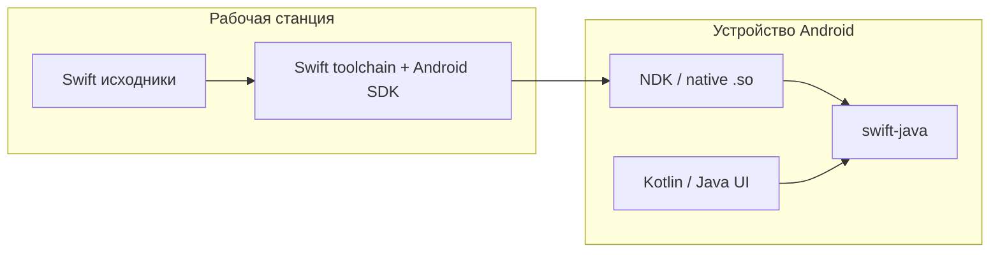

import ExternalPlayEmbed from '@site/src/components/ExternalPlayEmbed';

# Swift SDK для Android

  НЕ ОБЯЗАТЕЛЬНО
  ДЛЯ НОВИЧКОВ

Анонс **ночных сборок Swift SDK для Android** на [официальном блоге Swift](https://www.swift.org/blog/nightly-swift-sdk-for-android/) — важный шаг: язык перестаёт быть только "экосистемой Apple" и получает формализованный путь на вторую мобильную платформу.

<ExternalPlayEmbed example="tools-documentation/cross-platform-mobile-play" title="Cross Platform Mobile" />

---

## Что изменилось

До анонса Swift ассоциировали с **iOS, iPadOS, macOS, watchOS, tvOS**. Рабочая группа **Android workgroup** сняла часть архитектурных барьеров: Swift-код можно собирать в машинный код под Android через **LLVM** и **NDK**, с учётом ABI целевых устройств.

**Swift SDK для Android** — набор инструментов, заголовков, runtime и библиотек для сборки на macOS, Linux и Windows (в т.ч. через установщик Swift для Windows).

---

## Интероп и экосистема

Ключевой элемент — **swift-java**: библиотеки и генератор привязок для вызова Java из Swift и использования Swift-модулей в приложениях на **Java/Kotlin**. Это позволяет **поэтапно** внедрять Swift в существующие проекты, не переписывая UI целиком.

По [Swift Package Index](https://swiftpackageindex.com/) уже **более 25%** пакетов компилируются на Android — значит, часть экосистемы изначально переносима или не завязана на Apple-only API.

---

## Практический смысл

| Сценарий | Оценка |
|----------|--------|
| Общая бизнес-логика Swift для iOS + Android | Перспективно, но пока **preview** |
| Полная замена Kotlin/Java | Маловероятно в ближайшие годы |
| Встраивание в legacy Android | Реалистичный первый шаг |

Разработка ведётся открыто: форумы Swift, project board, CI. Готовится **vision document** по приоритетам Android-направления.

  
См. также

  

  Сравнение с официальным курсом Google по [Kotlin Multiplatform](/tools/documentation/5) — в интерактивном блоке выше.

  

---

## В энциклопедии

- [Мобильные приложения — о разделе](/encyclopedia/4-code-dev/4-12-mobilnye-prilozheniya/intro) — платформы, жизненный цикл, сторы
- [Kotlin](/encyclopedia/5-languages/5-09-kotlin/intro) — язык Android и KMP
- [Swift](/encyclopedia/5-languages/5-14-swift/intro) — экосистема Apple и кроссплатформенные эксперименты

---
