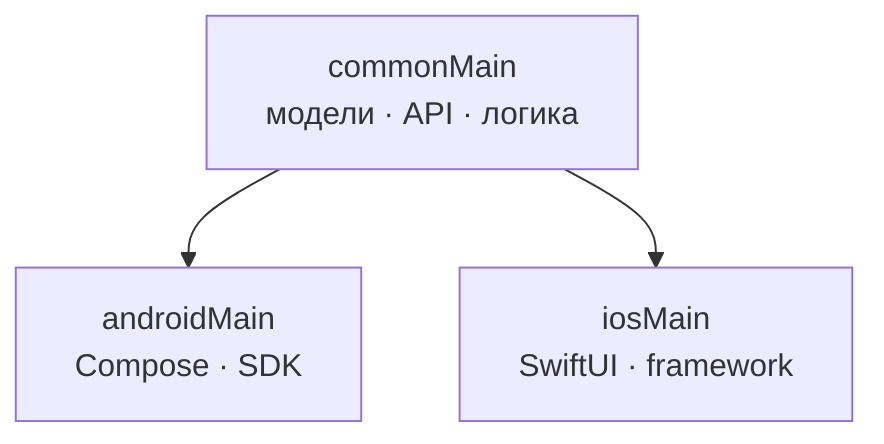

import ExternalPlayEmbed from '@site/src/components/ExternalPlayEmbed';

# Kotlin Multiplatform

  НЕ ОБЯЗАТЕЛЬНО
  ДЛЯ НОВИЧКОВ

Google опубликовала бесплатный **pathway** по [Kotlin Multiplatform (KMP)](https://developer.android.com/courses/pathways/kotlin-multiplatform) в документации для Android-разработчиков. Это сигнал: KMP рассматривается как стратегический способ делить код между платформами **без отказа от нативного UI**.

<ExternalPlayEmbed example="tools-documentation/cross-platform-mobile-play" title="Cross Platform Mobile" />

---

## Суть KMP

**Kotlin Multiplatform** выносит в общий модуль (`commonMain`) то, что должно вести себя одинаково:

- модели и валидация;
- сетевой слой и сериализация;
- use cases и доменная логика.

Платформенные детали остаются в **expect/actual**: на Android — OkHttp, Coroutines, Android SDK; на iOS — URLSession, Kotlin/Native, подключение к Xcode через framework или CocoaPods.

---

## Что даёт официальный курс

Pathway сочетает теорию, видео и практику:

1. **Когда KMP оправдан** — корпоративные приложения с единой логикой на iOS и Android.
2. **Интеграция в Android-проект** — Gradle-модуль, зависимости, сборка.
3. **expect/actual** — единый контракт, разные реализации (HTTP, хранилище, аналитика).
4. **Связка с iOS** — фреймворк в Xcode, типичные ошибки сборки.
5. **Миграция legacy** — перенос слоёв из монолита без "большого взрыва".

Формат рассчитан на разработчиков, которые уже знают **Kotlin** и основы **Android**.

---

## KMP и Flutter / React Native / Swift на Android

| Подход | UI | Общий код |
|--------|-----|-----------|
| **KMP** | Нативный на каждой платформе | Kotlin `commonMain` |
| **Flutter / RN** | Единый рендер / bridge | Один UI-стек |
| **Swift SDK (Android)** | Нативный Android + Swift-модули | Swift + swift-java |

KMP не заставляет отказываться от **Jetpack Compose** или **SwiftUI** — снижается риск "чужого" UX и проблем производительности мостов.

  
Практика

  

  Начните с **одного модуля** (например, API-клиент + DTO), покройте контрактными тестами в `commonTest`, затем подключайте iOS. Параллельно следите за [Swift SDK для Android](/tools/documentation/4), если стек команды уже на Swift.

  

---

## Связанные материалы

- [Мобильные приложения](/encyclopedia/4-code-dev/4-12-mobilnye-prilozheniya/1) — обзор платформ в энциклопедии
- [Подборка документации](/tools/documentation/2) — Kotlin Docs, Android Developer
- [Подборка статей](/tools/documentation/3) — архитектура и процессы

---
